[TOC]

# 《Generative Adversarial Nets》

[论文链接](https://arxiv.org/abs/1406.2661)
[视频链接](https://youtu.be/dyZXMqnS_x0)
这篇论文提出了GAN

-------

## 生成模型

### Need Explicit Density
Pixel RNN/CNN
VAE
Markov Chain
Boltzmann Machine

### No Need Explicit Density
GAN
GSN

-------

## Intuitional Explanation

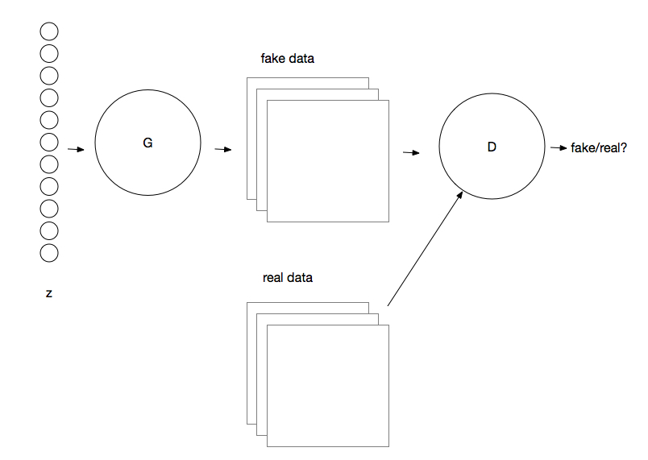

-------

## Objective Function

### 极大似然估计

对于真实数据$x$和生成数据$G(z)$，经过判别器判别后的，$D$认为$x$是真样本的概率为$D(x)$，$D$认为$G(z)$是假样本的概率为$1-D(G(z))$，那么对于$D$有$log$似然函数为：
$$L=log[D(x)*(1-D(G(z)))]$$
[极大似然估计-张宇](https://zhuanlan.zhihu.com/p/50484278)
[极大似然估计-李宏毅](https://youtu.be/CppM-5Vogl4)

### GAN的目标函数

$$ \min _{G}\max _{ D } V(D,G)={ E }_{ x ～ { p }_  { data } (x) }[logD(x)] + { E }_{ z ～ { p }_{ z }(z) }[log(1-D(G(z)))]\ $$
$D(x)$和$D(G(z))$分别表示$x$和$G(z)$经过判别器$D$的判别后，$D$认为输入样本是真样本的概率，则$1-D(G(z))$表示$D$将假样本判断为假的概率；那么，真实的概率分布与$D$判断出来的情况列表如下：

**Note:$D$输出的是概率，那么$D$的输出层的激活函数必须是$sigmoid$**

| $D$ | $D$将真样本$x$判断为真的概率:$D(x) $| $D$将假样本$G(z)$判断为假的概率:$1-D(G(z)$ |
| --- | --- | --- |
| 真实情况 | 真样本$x$为真的概率:1 | 假样本$G(z)$为假的概率:1 |
| 用交叉熵作为目标函数 | $1*log[D(x)]对应第一项$ | $1*log[1-D(G(z))]$对应第二项 |

### 对抗

$D$的目标是要尽可能把真的样本判断为真，对应最大化第一项：${ E }_{ x ～ { p }_  { data } (x) }[logD(x)]$
把假的样本判断为假，对应最大化第二项：${ E }_{ z ～ { p }_{ z }(z) }[log(1-D(G(z)))]\ $
总之，也就是说$D$要最大化Objective Function；

同理，$G$的目标是要尽可能的让$D$将自己生成的假样本判断为真，把真实的样本判断为假，要最小化这两项之和：$ { E }_{ x ～ { p }_  { data } (x) }[logD(x)] + { E }_{ z ～ { p }_{ z }(z) }[log(1-D(G(z)))]\ $
总的来说，这是一个minmax Game；

**Note:实际训练当中，训练$G$的时候$D$的参数是固定的，$G$并不干扰$D$对真实数据的判断，$G$需要$D$的正确引导，$G$只是不断提升自己生成数据的能力。**

-------

## Loss Function

$D$的损失函数：
$$Loss_D = -[1*logD(x) + 1*log(1-D(G(z)))] $$
$G$的损失函数：
$$Loss_G = 0*logD(x) + 1*log(1-D(G(z)))=log(1-D(G(z)))$$

-------

## 具体算法过程

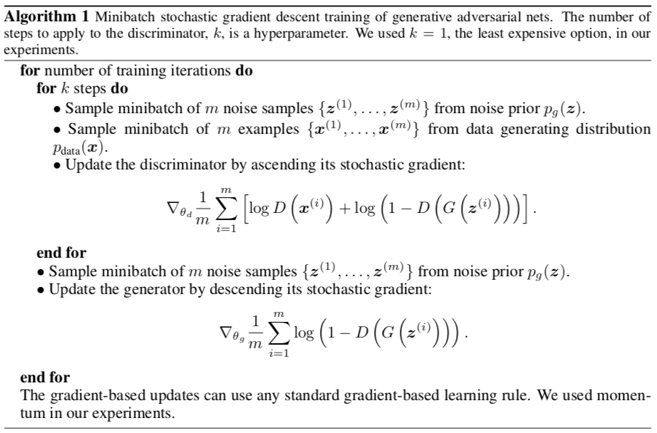

Note：
1、先更新$D$，再更新$G$，只有$D$有了正确的判断能力，$G$才能按照$D$的指示来更新;
2、可以设置一个超参数k来协调$D$、$G$两者之间更新的次数比例;
3、在训练$G$的时候$D$的参数要固定，在训练$D$的时候$G$的参数要固定;

-------

## G替代版的Loss Function

由于$G(z)$是从噪声中生成的样本，所以在最开始$G$生成的样本非常假，很容易被$D$抓出来，也就是说$D(G(z))$非常小,那么$Loss_G = log(1-D(G(z)))$就非常接近0，在反向传播的时候就不能够传播足够的梯度给$G$来更新参数，所以我们从Heuristic的角度来理解：我们本身是要最小化$D$抓出来假样本的概率，现在我们可以换成最大化$D$抓不出来的概率，也就是将$G$的损失函数换成：
$$Loss_G=-logD(G(z)) $$
由于$D$是按照：
$$Loss_G = log(1-D(G(z)))$$
训练的，那么如果损失函数换成：
$$Loss_G=-logD(G(z)) $$
这两项不是等价的，所以$D$给出的值就能够提供足够的梯度。

**Note:
$Loss_G =log(1-D(G(z)))$对应的GAN叫做MMGAN
$Loss_G=-logD(G(z)) $对应的GAN叫做NSGAN**

从函数图像上，可以直观的看出，两种损失函数的梯度变化趋势：
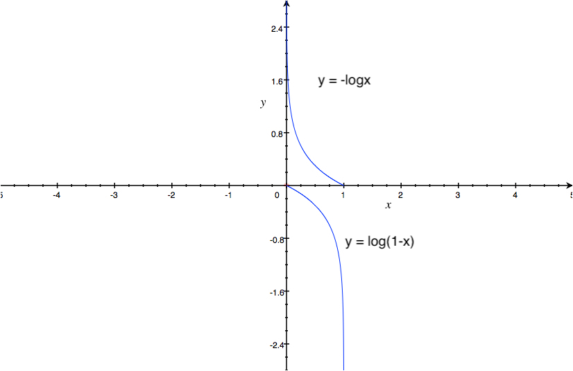

-------

## D的最优解

对于一个具体的样本$x$，它可能来自真实分布也可能来自生成分布，判别器判断的结果是$D(x)$,代入$D$的损失函数有:
$$Loss_D = -[{P}_{r}(x)*log[D(x)] + {P}_{g}(x)*log[1-D(x)]]$$
对$D(x)$求偏导数有：
$${ \frac { \partial Loss_{ D } }{ \partial D(x) } =-\frac { { P }_{ r }(x) }{ D(x) }  }+\frac { { P }_{ g }(x) }{ 1-D(x) } $$
令偏导数等于0:
$${ -\frac { { P }_{ r }(x) }{ D(x) }  }+\frac { { P }_{ g }(x) }{ 1-D(x) } =0$$
求出最优判别器${ D }^{ * }(x)$:
$${ D }^{ * }(x)=\frac { { P }_{ r }(x) }{ { P }_{ r }(x)+{ P }_{g}(x)}$$
我们知道对于$G$来说，最好的$G$是让：
$${ P }_{ r }(x) = { P }_{ g }(x)$$
此时，有：
$${ D }^{ * }(x)=1/2$$
也就是说最好的生成器使最好的判别器无法判别出来样本是生成样本还是真实样本。

-------

## <span id="3">当D最优时，G的损失函数到底在干什么？</span>

将最优判别器${ D }^{ * }(x)$代入Objective Function,有：
$$ \min _{G}\max _{ D } V(D,G)={ E }_{ x ～ { p }_  { data } (x) }log\frac { { P }_{ r }(x) }{ { P }_{ r }(x)+{ P }_{g}(x)} + { E }_{ z ～ { p }_{ z }(z) }log\frac { { P }_{ g }(x) }{ { P }_{ r }(x)+{ P }_{g}(x)} $$
稍作变换有：
$$ \min _{ G } \max _{ D } V(D,G)={ E }_{ x～{ p }_{ { data } }(x) }log\frac { { P }_{ r }(x) }{ \frac { 1 }{ 2 } [{ P }_{ r }(x)+{ P }_{ g }(x)] } +{ E }_{ z～{ p }_{ z }(z) }log\frac { { P }_{ g }(x) }{ \frac { 1 }{ 2 } [{ P }_{ r }(x)+{ P }_{ g }(x)] } -2log2$$

于是：
$$ \min _{G}\max _{ D } V(D,G)=2JS({ P }_{ r }||{ P }_{ g })-2log2 $$
所以，当判别器$D$最优的时候，生成器$G$是在减小真实分布与生成分布之间的$JS$散度（这个是根据MMGAN推导得到的结论）。

**Note:
$KL$散度：$KL({ P }_{ 1 }||{ P }_{ 2 })={ P }_{ 1 }\log { \frac { { P }_{ 1 } }{ { P }_{ 2 } }  } $
$JS$散度：$ JS({ P }_{ 1 }||{ P }_{ 2 })=\frac { 1 }{ 2 } KL({ P }_{ 1 }||\frac { { P }_{ 1 }+{ P }_{ 2 } }{ 2 } )+\frac { 1 }{ 2 } KL({ P }_{ 2 }||\frac { { P }_{ 1 }+{ P }_{ 2 } }{ 2 } ) $**

-------

## <span id="4">MMGAN的问题</span>

对于生成器$G$来说，当判别器$D$最优时，$G$的损失函数为：
$$Loss_G={ P }_{ g }(x)*log\frac { { P }_{ g }(x) }{ { P }_{ r }(x)+{ P }_{g}(x)}$$
这里有一个难理解的点：我们的目标函数是$logD(x)$和$log(1-D(G(z)))$的期望之和，在实际训练的时候我们知道$x$和$G(z)$到底是生成的还是真实的，所以${ P }_{ r }$和${ P }_{ g }$直接按照1和0来，但是我们考虑一下这种情况，如果真实数据和生成数据有一模一样的，我们还能按照1和0来吗？当然不是，这就要按照两种分布的Density Function来得到对于样本$x$来自两种分布的概率分别是多少；所以在这种两类数据有重合的情况下${ P }_{ r }$和${ P }_{ g }$是不确定的，这就是为什么目标函数用期望来表达；但是实际情况中$x$和$G(z)$重合的概率几乎为零，那么对与$Loss_G$来说，${ P }_{ g }=1$且${ P }_{ r }=0$，$Loss_G=0$，G没有梯度来更新参数。

为什么$x$和$G(z)$重合的部分可以忽略不计?
* 真实分布与生成分布的支撑集(support)是高维空间中的低维流形(manifold)，真实分布与生成分布重叠部分测度(measure)为0，这句话可以这么理解：从一个三维空间里面随机取两个二维曲面，他们重合的部分(线)相对于他们本身(面)可以忽略；在一个二维平面上随机画两条曲线他们重合的部分(点)相对于他们本身(面)可以忽略。
* 通俗来讲就是说随意一个噪声，随意一个$G$，能直接生成出跟真实分布相同的样本来的概率为0，生成不出来那么生成分布和真实分布就没有可能重合。
* 想象一下如果$G$既能生成接近于真的又能生成接近于假的，那么损失函数就知道朝哪个方向做梯度下降，但生成接近真实的这件事儿不会发生，所以生成器的损失函数的在乱跑。

**Note：最优的判别器只与数据本身的分布${ P }_{ r }$和${ P }_{ g }$有关，而$G(z)$给出的数据使得${ P }_{ r }$和${ P }_{ g }$为常数（两者重叠部分可忽略），生成器将不知所措。**

-------

## NSGAN的问题

### 判别器最优时NSGAN在做什么？

* 将$D^*(x) $代入NSGAN的$Loss_G$有：
$$Loss_G=-{P}_{g}(x)*logD^*(x) \quad (1)$$

* 由上面的推导有：
$${P}_{r}(x)*log[D^*(x)] + {P}_{g}(x)*log[1-D^*(x)]=2JS({ P }_{ r }||{ P }_{ g })-2log2  \quad (2)$$

* $KL$散度变换
$KL({ P }_{ g }(x)||{ P }_{ r }(x))\\
={ P }_{ g }(x)*\log { \frac { { P }_{ g }(x) }{ { P }_{ r }(x) }  } \\ 
={ P }_{ g }(x)*\log { \frac { { P }_{ g }(x)/({ P }_{ r }(x)+{ P }_{ g }(x)) }{ { P }_{ r }(x)/({ P }_{ r }(x)+{ P }_{ g }(x)) }  } \\ 
={ P }_{ g }(x)*\log  \frac { 1-D^{ * }(x) }{ D^{ * }(x) } \\ 
={ P }_{ g }(x)log[1-D^{ * }(x)]-{ P }_{ g }(x)logD^{ * }(x)  \quad (3)$

由$(1)$、$(3)$得：
$$
Loss_{ G }=KL({ P }_{ g }(x)||{ P }_{ r }(x))-{ P }_{ g }(x)log[1-D^{ * }(x)](4)
$$

由$(2)$、$(4)$得：
$$
Loss_{ G }=KL({ P }_{ g }(x)||{ P }_{ r }(x))-2JS({ P }_{ r }||{ P }_{ g })+{P}_{r}(x)*log[D^*(x)]+2log2
$$

**Note：从上面的式子可以看出KL散度和JS散度同时存在且方向相反，而JS散度和KL散度都是衡量两个分布距离的度量，且是单调性同步的函数，这样的话就会导致梯度的方向不稳定，一会儿上升一会儿下降，所以这个替代版的损失函数也不是一个好的选择。**

### <span id="2">只用KL散度会怎样？</span>

KL Divergence不是对称的距离，也就是说：
$KL({ P }_{ g }(x)||{ P }_{ r }(x)) \neq KL({ P }_{ r }(x)||{ P }_{ g }(x))$

#### 第一种KL散度

$KL({ P }_{ g }(x)||{ P }_{ r }(x))={ P }_{ g }(x)*\log { \frac { { P }_{ g }(x) }{ { P }_{ r }(x) }  } $

输入给D的生成图片要么靠近真实分布：
${ P }_{ g }(x)=0 \quad { P }_{ r }(x)=1；KL({ P }_{ g }(x)||{ P }_{ r }(x))趋近于0$，如下图：


要么靠近生成分布：
${ P }_{ g }(x)=1 \quad { P }_{ r }(x)=0；KL({ P }_{ g }(x)||{ P }_{ r }(x))趋近于+\infty$

显然这个$KL$散度是没有办法让$G$收敛到真实分布的
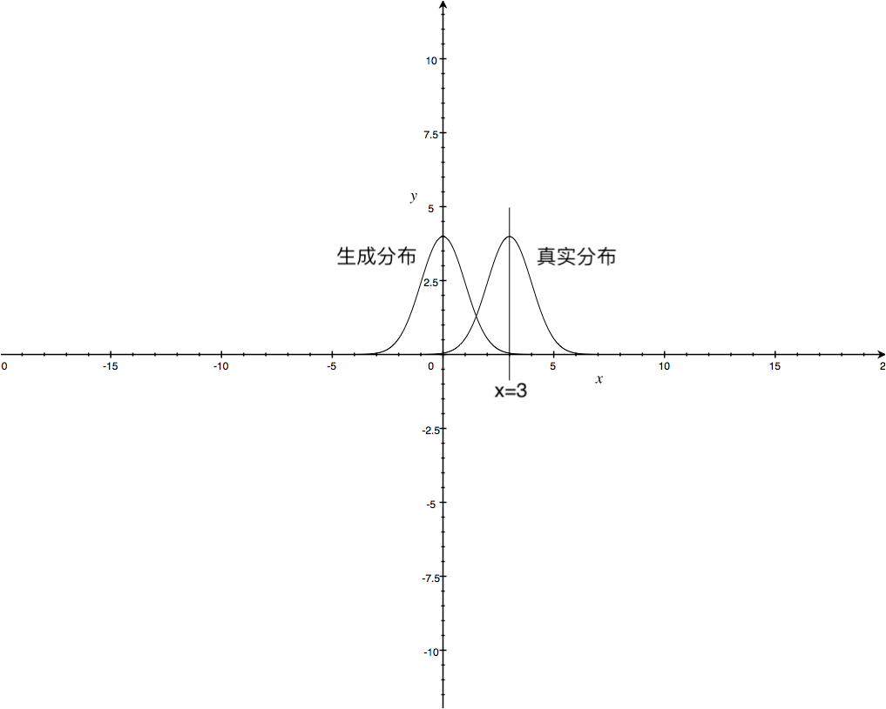

**Note：如上图，假如输入的是$x=3$这个点，${ P }_{ g }(x)=0 \quad { P }_{ r }(x)=1$，正常来说生成分布应该去靠近这个点，有较足够的梯度，而上述散度却并非如此。**

#### <span id="6">第二种KL散度</span>

$KL({ P }_{ r }(x)||{ P }_{ g }(x))={ P }_{ r }(x)*\log { \frac { { P }_{ r }(x) }{ { P }_{ g }(x) }  } $

输入给D的生成图片要么靠近真实分布：
${ P }_{ g }(x)=0 \quad { P }_{ r }(x)=1；KL({ P }_{ r }(x)||{ P }_{ g }(x))趋近于+\infty$

要么靠近生成分布：
${ P }_{ g }(x)=1 \quad { P }_{ r }(x)=0；KL({ P }_{ r }(x)||{ P }_{ g }(x))趋近于0$

这个是想要的效果；但是这就导致了mode missing的问题，当生成器生成的样本不真实时生成器的梯度较大，会像真实分布密度高的区域靠近，当生成器靠近一个真实分布较高的区域学习率就会趋紧于0，而如果还有其他的真实分布密度较高的区域生成器就到达不了了，这就是'mode missing'，图示如下：

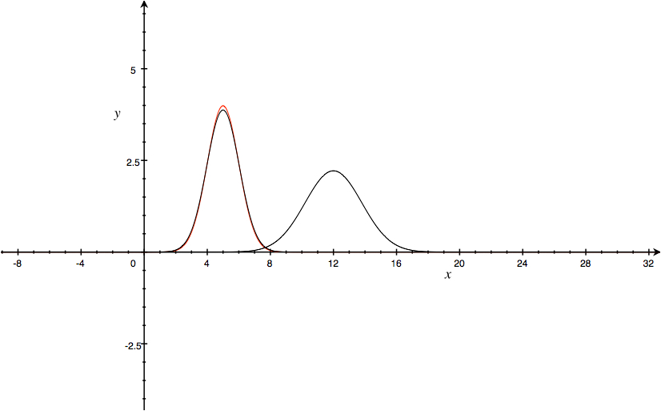

**Note：如果$x$比较假${ P }_{ g }(x)$也不知道朝哪里动才好，那就呆着不动也就是$KL$散度趋近于0，如果$x$比较真${ P }_{ g }(x)$就往$x$靠近；但是$KL$散度在这种情况下为0是不对的，因为$KL$表征的是两个分布的相似度，0表示相同，也就是${ P }_{ r }(x)={ P }_{ g }(x)$，意思是当两者相同了就不动了；这一点在[One-sided label smoothing] (#1)提出了一个解决办法。**

-------

## 补充知识

### 信息量

$ I(x) = -\log {p(x)} = \log { \frac { 1}{ p (x) }  } $
一个事件发生的概率越大，这件事情发生所包含的信息量就越小，比如说一个高富帅追求一个白富美，追到手了没有什么稀奇的，因为这是一件概率很高的事情，但是如果一个矮穷矬追求一个白富美，追到手了，这种事情发生的概率很低，其中一定有其他的原因：比如这个矮穷矬救过白富美的命或者这个矮穷矬器大活好不黏人，所以概率低的事情发生所包含的信息量大；两个相互独立的事情同时发生的信息量是两者单独发生的信息量之和。

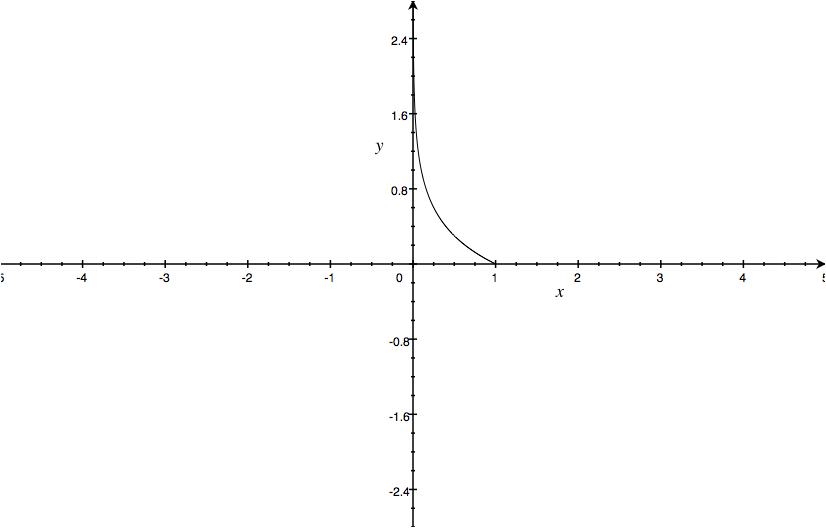

### 信息熵

信息量的均值
$$H(x) = - \sum _{ x } p(x)log p(x) $$

### Huffman Coding

text = abbcdbcccdccaecfeccc
对text中的字母进行编码，总共有6个字母，如果每个字母的编码长度相同的话最少需要3个字节，如下表所示：

| Letter  | Frequency | Probability | Bits |
| --- | --- | --- | --- |
| a | 2 | 0.10 | 3*2=6 |
| b | 3 | 0.15 | 3*3=9 |
| c | 10 | 0.50 | 3*10=30 |
| d | 2 | 0.10 | 3*2=6 |
| e | 2 | 0.10 | 3*2=6 |
| f | 1 | 0.05 | 3*1=3 |
| total bits|  | | 60 |

Huffman Coding，首先将字母按照使用频率从低到高排序：f-a-d-e-b-c

画出霍夫曼树：
 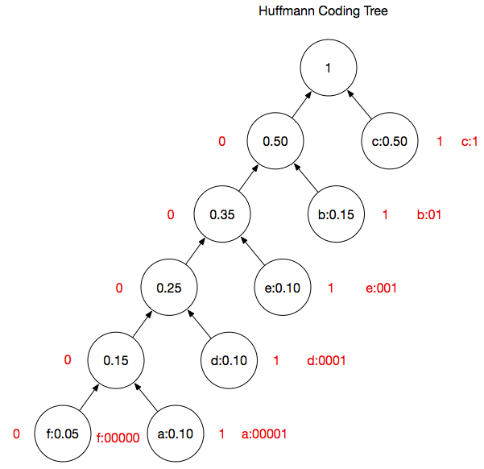

| Letter  | Frequency | Probability | Bits(Huffmann Coding) |
| --- | --- | --- | --- |
| a | 2 | 0.10 | 5*2=10 |
| b | 3 | 0.15 | 2*3=6 |
| c | 10 | 0.50 | 1*10=10 |
| d | 2 | 0.10 | 4*2=8 |
| e | 2 | 0.10 | 3*2=6 |
| f | 1 | 0.05 | 5*1=5 |
| total bits|  | | 45 |
| average bits|  | | 8.55 |

[Reference](https://www.youtube.com/watch?v=voHOxYyFhlc)

### 平均编码长度

对数的底数设置为2的话，熵$H(x) = - \sum _{ x } p(x)log p(x) $就是平均编码长度。

通过熵的公式计算text的平均编码长度：

```
>>> from math import *
>>> -(2*0.1*log(0.1, 2) + 3*0.15*log(0.15, 2) + 10*0.5*log(0.5, 2) \
... + 2*0.1*log(0.1, 2) + 2*0.1*log(0.1, 2) + 1*0.05*log(0.05, 2))
8.440887779051577
>>> 
```

[Reference](https://blog.csdn.net/AckClinkz/article/details/78740427)

### 交叉熵

$$H(P, Q) = - \sum _{ x } p(x)log q(x) $$
用估计编码$q(x)$近似真实编码$p(x)$需要的平均编码长度

### 交叉熵与MSE

交叉熵代价函数在相同条件下的学习速率较$MSE$快，在梯度反向传播时，会有一个乘子，而交叉熵代价函数能够把这个乘子给约掉，很好的避免了学习速度下降。

### KL散度

又名相对熵：$$D_{KL}(P||Q)=- \sum _{ x } p(x)log q(x) + \sum _{ x } p(x)log p(x) =H(P, Q)-H(P)$$

### JS散度

$$D_{JS}(P||Q)={\frac{1}{2}} KL(P||M) + {\frac{1}{2}} KL(Q||M) \quad \quad M = {\frac{1}{2}}(P+Q)$$

-------

## 实验

[代码链接](https://github.com/andyhujinzhao/GAN)

-------

## 论文研读

### 第一处

**Introduction**
These striking successes have primarily been based on the backpropagation and dropout algorithms, using piecewise linear units [19, 9, 10] which have a particularly well-behaved gradient . Deep generative models have had less of an impact, due to the difficulty of approximating many intractable probabilistic computations that arise in maximum likelihood estimation and related strategies, and due to difficulty of leveraging the benefits of **piecewise linear units** in the generative context. We propose a new generative model estimation procedure that sidesteps these difficulties.
在分类问题中piecewise linear units给反传播算法提供了很好的梯度，但在生成模型中却不能受益于piecewise linear units

### 第二处

**Related work**
涉及的其他生成算法有：
RBMs、DBMs、MCMC、DBNs、NCE

### 第三处

**Adversarial nets**
In the next section, we present a theoretical analysis of adversarial nets, essentially showing that the training criterion allows one to recover the data generating distribution as G and D are given enough capacity
对$G$和$D$有一个假设：enough capacity

### 第四处

**Adversarial nets**
In practice, we must implement the game using an iterative, numerical approach. Optimizing D to completion in the inner loop of training is computationally prohibitive, and on finite datasets would result in overfitting. Instead, we alternate between k steps of optimizing D and one step of optimizing G.
在实际训练当中$D$不能直接训练好，而是训练k次$D$后训练一次$G$

### 第五处

**Adversarial nets**
In practice, equation 1 may not provide sufficient gradient for G to learn well. Early in learning, when G is poor, D can reject samples with high confidence because they are clearly different from the training data. In this case, log(1 − D(G(z))) saturates. Rather than training G to minimize log(1 − D(G(z))) we can train G to maximize log D(G(z)). This objective function results in the same fixed point of the dynamics of G and D but provides much stronger gradients early in learning.
在最开始训练的时候$G$比较差，$D$很容易就判断出生成样本，$ log(1 − D(G(z)))$就处在饱和区，可以将$G$的损失函数替换为$-log D(G(z))$

### 第六处

**Adversarial nets**

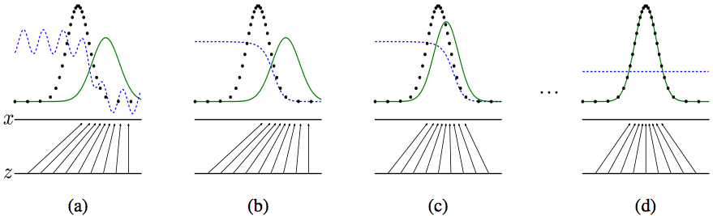

-------

## GAN的不足

1、神经网络固有的问题：梯度消失
2、Mode missing问题
3、JS散度或KL散度作为损失函数带来的问题

-------

# 《Improved Techniques for Training GANs》

[论文链接](https://arxiv.org/abs/1606.03498)

-------

## 论文研读

### 第一处

**Abstract**
We focus on two applications of GANs: semi-supervised learning, and the generation of images that humans find visually realistic.
半监督学习和图像生成

### 第二处

**Abstract**
However, training GANs requires finding a Nash equilibrium of a non-convex game with continuous, highdimensional parameters. GANs are typically trained using gradient descent techniques that are designed to find a low value of a cost function, rather than to find the Nash equilibrium of a game. When used to seek for a Nash equilibrium, these algorithms may fail to converge.
损失函数是非凸的，所以要找一个纳什均衡的最小值很难。

### 第三处

**Toward Convergent GAN Training**
Unfortunately, a modification to $θ(D)$ that reduces $J(D)$ can increase $J(G)$ , and a modification to $θ(G)$ that reduces $J(G)$ can increase $J(D)$ . Gradient descent thus fails to converge for many games.
$D$参数的改变可以减小$D$的损失，但是可能增加$G$的损失，$G$参数的改变可以减少$G$的损失但是可能增加$D$的损失，导致很多训练不能收敛。

### 第四处

**Toward Convergent GAN Training**

#### Feature matching

Specifically, we train the generator to match the expected value of the features on an intermediate layer of the discriminator. This is a natural choice of statistics for the generator to match, since by training the discriminator we ask it to find those features that are most discriminative of real data versus data generated by the current model.让$G$直接学习$D$中间层的特征，因为$D$清楚哪些特征是重要的可以容易区分出生成样本和真实样本，$G$就直接去学习这些特征。中间层的损失函数设置为：$||E_{x∼p_{data}} f(x) − E_{z∼p_z (z)} f(G(z))||^2 _2 \quad $($f(x) $ denote activations on an intermediate layer of the discriminator)

#### Historical averaging

When applying this technique, we modify each player’s cost to include a term $||θ − \frac {1} {t} \sum_{i=1} ^t  θ[i]||^2$ where $θ[i]$ is the value of the parameters at past time $i$. The historical average of the parameters can be updated in an online fashion(在线更新) so this learning rule scales well to long time series. This approach is loosely inspired by the fictitious play algorithm that can find equilibria in other kinds of games. We found that our approach was able to find equilibria of low-dimensional, continuous non-convex games, such as the minimax game with one player controlling $x$, the other player controlling $y$, and value function $(f(x) − 1)(y − 1)$, where $f(x) = x$ for $x < 0$ and $f(x) = x^2$ otherwise,For these same toy games, gradient descent fails by going into extended orbits that do not approach the equilibrium point.如上面第三处所述，判别器和生成器都处在动态变化中，上一步优化的目标，下一步由于对手的变化导致优化目标都变了，所以可以考虑用到历史的参数信息来保证参数在时间上的连续性。

**Note：Fictitious play algorithm in game theory, fictitious play is a learning rule first introduced by George W. Brown. In it, each player presumes that the opponents are playing stationary (possibly mixed) strategies. At each round, each player thus best responds to the empirical frequency of play of their opponent. Such a method is of course adequate if the opponent indeed uses a stationary strategy, while it is flawed if the opponent's strategy is non-stationary. The opponent's strategy may for example be conditioned on the fictitious player's last move.**

#### Minibatch discrimination

One of the main failure modes for GAN is for the generator to collapse to a parameter setting where it always emits the same point, the discriminator processes each example independently, there is no coordination between its gradients, and thus no mechanism to tell the outputs of the generator to become more dissimilar to each other. any discriminator model that looks at multiple examples in combination, rather than in isolation, could potentially help avoid collapse of the generator.通过让D一次综合性的判断一批样本，而不是单独看待一批样本中的每一个来避免mode collapse，具体的做法：设$f(x_i)∈ℝ^A$是输入$x_i$在判别器中间层的特征向量，我们将$f(x_i)∈ℝ^A$乘以一个张量$T∈ℝ^{A*B*C}$，得到一个矩阵$M_i∈ℝ^{B*C}$，然后再按行对$M_i$两两计算$L_1$-distance，$i ∈ {1, 2, . . . , n}$，再做处理：$c_b (x_i , x_j ) = exp(−||M_{i,b} − M_{j,b} ||_{L_1} )∈ ℝ$，整个过程图示如下：
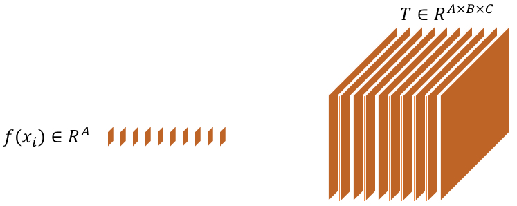
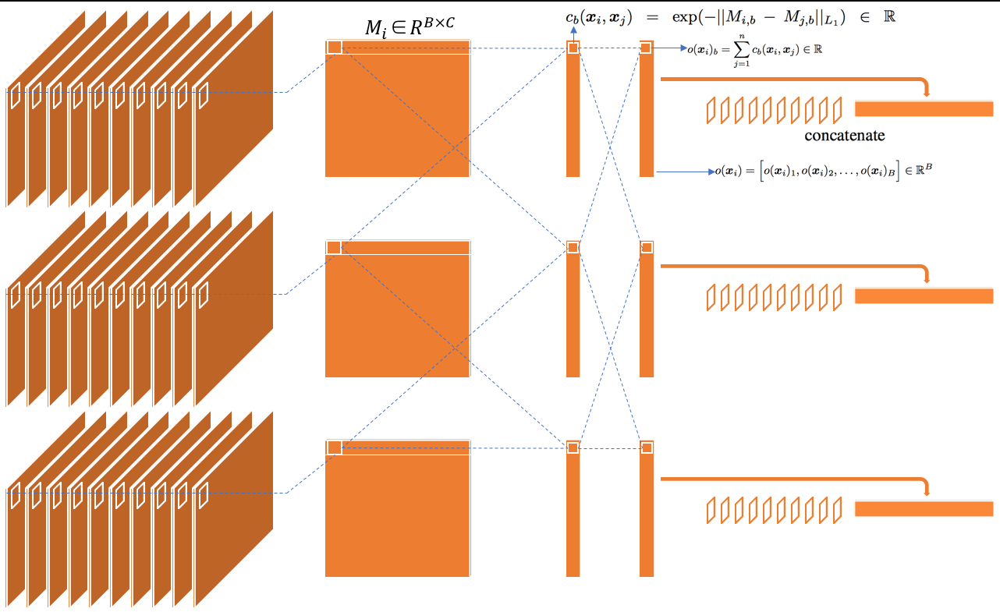
再将concatenate后的结果feed给下一层，最后的损失函数一切照常，不做变化，这时D就able to use the other examples in the minibatch as side information.

#### <span id="1">One-sided label smoothing</span>

replaces the 0 and 1 targets for a classifier with smoothed values, like .9 or .1, and was recently shown to reduce the vulnerability of neural networks to adversarial examples. Replacing positive classification targets with α and negative targets with β, the optimal discriminator becomes $D(x) = \frac {αp_{data} (x)+βp_{ model } (x)}{p_{data} (x)+p_{ model } (x)}$;把优化目标从降低到$α$，The presence of $p_{model}$ in the numerator(分子) is problematic(有问题的) because, in areas where $p_{data}$ is approximately zero and $p_{model}$ is large, erroneous samples from $p_{model}$ have no incentive to move nearer to the data. We therefore smooth only the positive labels to α, leaving negative labels set to 0.$D(x) $中分子项出现$p_{model}$的问题是在$p_{data}$低的区域$p_{model}$可能很高，这样的话$D(x)$就很大，不能给生成器incentive去靠近$p_{data}$，因此我们可以把正样本的标签概率调整到$α$，负样本的标签概率设置为0。

#### Virtual batch normalization

Batch normalization greatly improves optimization of neural networks, and was shown to be highly effective for DCGANs [3]. However, it causes the output of a neural network for an input example $x$ to be highly dependent on several other inputs $x'$ in the same minibatch. To avoid this problem we introduce virtual batch normalization (VBN), **in which each example $x$ is normalized based on the statistics collected on a reference batch of examples that are chosen once and fixed at the start of training, and on $x$ itself.** The reference batch is normalized using only its own statistics. VBN is computationally expensive because it requires running forward propagation on two minibatches of data, so we use it only in the generator network.
VBN:训练之初，先按照statistics选出来一个reference batch，算出来均值和方差用于对每个$x$做batch normalization。

### 第五处

**Assessment of image quality**

#### 方法一

Generative adversarial networks lack an objective function, which makes it difficult to compare performance of different models. One intuitive metric of performance can be obtained by having human annotators judge the visual quality of samples.
真人图灵测试

#### 方法二

We apply the Inception model^1 [19] to every generated image to get the conditional label distribution $p(y|x)$. Images that contain meaningful objects should have a conditional label distribution $p(y|x)$ with low entropy. Moreover, we expect the model to generate varied images, so the marginal $p(y|x = G(z))dz$ should have high entropy. Combining these two requirements, the metric that we propose is: $exp(E_x KL(p(y|x)||p(y)))$, where we exponentiate results so the values are easier to compare.we find between the quality reported by human annotators and the Inception score we developed in Section 4, which is explicitly constructed to measure the “objectness” of a generated image.
将生成出来的图片喂给Inception model

[Reference](https://arxiv.org/abs/1512.00567)

-------

## 实验

[论文源码](https://github.com/openai/improved-gan)

-------

# 《TOWARDS PRINCIPLED METHODS FOR TRAINING GENERATIVE ADVERSARIAL NETWORKS》

[论文地址](https://arxiv.org/abs/1701.04862)

-------

## Motivation

这篇文章主要从原理上探讨GAN存在的问题，而不是讲任何一种具体的算法

这篇paper分为三个部分：
1、探讨GAN现有问题
2、从原理上探究问题的原因
3、探讨一下现有的实验解决方案和理论解决方案

-------

## 论文研读

### 探讨GAN现有问题

#### KL散度
**INTRODUCTION**
Traditional approaches to generative modeling relied on maximizing likelihood, or equivalently minimizing the Kullback-Leibler (KL) divergence between our unknown data distribution $P_r$ and our generator’s distribution $P_g$ (that depends of course on $θ$). If we assume that both distributions are continuous with densities $P_r$ and $P_g$ , then these methods try to minimize$KL(ℙ_r||ℙ_g ) =∫_x P_r (x)log {\frac {P_r (x)} {P_g (x)}}d_x$, This cost function has the good property that it has a unique minimum at $P_g = P_r$ , and it doesn’t require knowledge of the unknown $P_r (x) $ to optimize it (only samples). However, it is interesting to see how this divergence is not symetrical between$ P_r$ and $P_g$ :传统的生成器依赖于最大似然估计的方法，这种方法等价于最小化真实分布与生成分布之间的$KL$散度，它的优点在于我们并不需要具体的知道真实分布，而只需要取样即可，但是KL散度有意思的是它并不是一个对称的距离：这一点在原始GAN的论文笔记：[只用KL散度会怎样？] (#2)中已经做了详细的解释，在这里仅放出本论文的原文：
* If $P_r(x) > P_g(x)$, then $x$ is a point with higher probability of coming from the data than being a generated sample. This is the core of the phenomenon commonly described as ‘mode dropping’: when there are large regions with high values of $P_r$ , but small or zero values in $P_g$ . It is important to note that when $P_r (x) > 0$ but $P_g (x) → 0$, the integrand inside the $KL$ grows quickly to infinity, meaning that this cost function assigns an extremely high cost to a generator’s distribution not covering parts of the data.
* If $P_r(x) < P_g(x)$, then $x$ has low probability of being a data point, but high probability of being generated by our model. This is the case when we see our generator outputting an image that doesn’t look real. In this case, when $P_r (x) → 0$ and $P_g (x) > 0$, we see that the value inside the $KL$ goes to 0, meaning that this cost function will pay extremely low cost for generating fake looking samples.

#### JS散度
参考：
1、[当D最优时，G的损失函数到底在干什么？] (#3)
2、[MMGAN的问题] (#4)

#### 若干问题
* Why do updates get worse as the discriminator gets better? Both in the original and the new cost function.

* Why is GAN training massively unstable?

* Is the new cost function following a similar divergence to the JSD? If so, what are its properties?

* Is there a way to avoid some of these issues?

##### SOURCES OF INSTABILITY
###### discriminator cost is maxed out
The theory tells us that the trained discriminator will have cost at most $2log2 − 2JSD(P_r ||P_ g )$. However, in practice, if we just train $D$ till convergence, its error will go to $0$, as observed in Figure 1
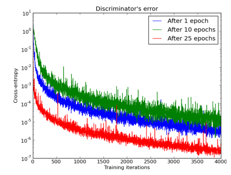
pointing to the fact that the $JSD$ between them is maxed out. The only way this can happen is if the distributions are not continuous^1 , or they have disjoint supports.
从理论上讲最优判别器的cost为$2log2 − 2JSD(P_r ||P_ g )$，在[当D最优时，G的损失函数到底在干什么？] (#3)处有详细推导，但是在实际训练中把$D$ train到收敛误差将变为0，误差可以训练到0说明$JSD(P_r ||P_ g )$可以训练到1，而$JSD$有界且其取值区间为[0, 1]，当${ P }_{ r }(x)=1 \quad { P }_{ g }(x)=0$或${ P }_{ r }(x)=0 \quad { P }_{ g }(x)=1$时取1，有界性证明[稍后解释](#5)；$D$能使$JSD$始终取上界说明两个分布始终处于可以处于$JS$ 散度的度量方式下的最大间距:${ P }_{ r }(x)=1 \quad { P }_{ g }(x)=0$或${ P }_{ r }(x)=0 \quad { P }_{ g }(x)=1$，那么什么样的分布能使得$P_g$和$P_r$始终处于$JSD$的上界？唯一可能的解释是the distributions are not continuous，这里有点比较难理解。是下面这样吗？
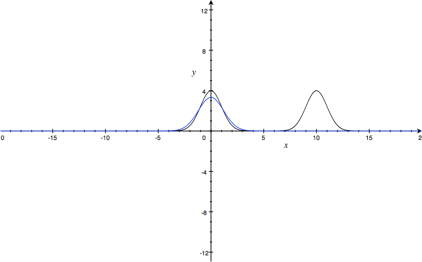
显然不是，虽然有mode missing的问题，但是只要他们有重合的部分$JSD$就不可能取上界，文中说到The only way this can happen is if the distributions are not continuous；上面的图示不是not continuous，文中注释说：By continuous we will actually refer to an absolutely continuous random variable (i.e. one that has a density), as it typically done. For further clarification see Appendix B.确切来说，见[关于连续的定义](#7)

There is strong empirical and theoretical evidence to believe that $P_r$ is indeed extremely concentrated on a low dimensional manifold (Narayanan & Mitter, 2010). As of $P_g$, we will prove soon that such is the case as well.
$P_r$非常集中在一个低manifold (Narayanan & Mitter, 2010)，$P_g$也是，在[这里](#8)给出了证明。

如果对于$P_r$来说没有density，那么$D$学到的并不是data的density，而是低维流形而已，所以$G$学习到的只是个别处的低维流形，为什么不是全部低维流形？因为有mode missing问题的存在，mode missing参考[第二种KL散度] (#6)，那么这样的话$P_r$和$P_g$的分布几乎没有重合部分，所以只要$D$一直train下去$JSD$就能到$0$。
###### <span id = '8'>永远有一个完美的D </span>
Let $g : Z → X$ be a function composed by affine transformations and pointwise nonlinearities, which can either be rectifiers, leaky rectifiers, or smooth strictly increasing functions (such as the sigmoid, tanh, softplus, etc). Then, $g(Z)$ is contained in a countable union of manifolds of dimension at most dim $Z$. Therefore, if the dimension of $Z$ is less than the one of $X$, $g(Z)$ will be a set of measure 0 in $X$.用下图来表示：
.jpg)
Driven by this, this section shows that if the supports of $P_r$ and $P_g$ are disjoint or lie in low dimensional manifolds, there is always a perfect discriminator between them, and we explain exactly how and why this leads to an unreliable training of the generator.
$P_r$ and $P_g$两个都是高维空间的disjoint低维流形，所以总有一个完美的$D$存在
###### <span id="7">关于连续的定义</span>
There are two different but very related properties a random variable can have. A random variable $X$ is said to be continuous if $P(X = x) = 0$ for all single points $x ∈ X$. Note that a random variable concentrated on a low dimensional manifold such as a plane can have this property. 连续型随机变量每个点的概率都为0
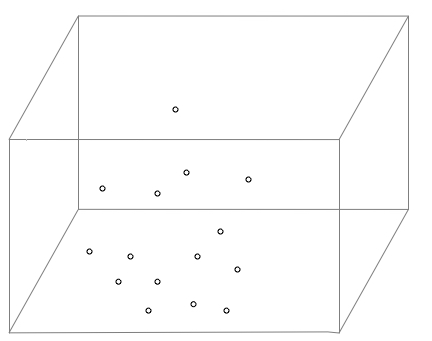
However, an absolutely continuous random variable has the following property: if a set $A$ has Lebesgue measure 0, then $P(X ∈ A) = 0$. Since points have measure 0 with the Lebesgue measure, absolute continuity implies continuity. 
勒贝格测度：一个线段$[a, b]$的勒贝格测度是它的长度$b-a$，一个长方形$[a, b]$，$[c, d]$的勒贝格测度为它的面积$(b-a)*(d-c)$，一个立方体$[a, b]$，$[c, d]$，$[e, f]$的勒贝格测度是它的体积$(b-a)*(d-c)*(f-e)$,以此类推；如果一个集合$A$的勒贝格测度为0，则$P(X ∈ A) = 0$，绝对连续意味着连续,因为连续是针对点来说的，条件更强；
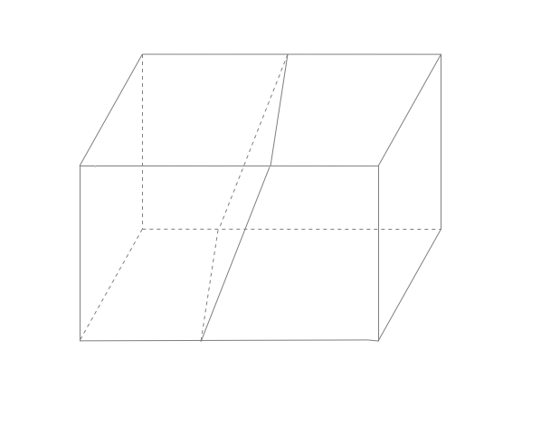
A random variable that’s supported on a low dimensional manifold therefore will not be absolutely continuous: let $M$ a low dimensional manifold be the support of $X$. Since a low dimensional manifold has $0$ Lebesgue measure, this would imply $P(X ∈ M) = 0$, which is an absurd since $M$ was the support of $X$. The property of $X$ being absolutely continuous can be shown to be equivalent to $X $ having a density: the existence of a function $f$ : $X → R $ such that $P(X ∈ A) = \int f(x) dx $ (this is a consequence of the Radon-Nikodym theorem). 
一个随机变量$X$的支撑集$M$是高维空间的低维流形，如果说是连续的那么它的支撑集$P(X ∈ M) = 0$，这就呵呵了，因为$P(X ∈ M) = 1$；

A The annoying part is that in everyday paper writing when we talk about continuous random variables, we omit the ‘absolutely’ word to keep the text concise and actually talk about absolutely continuous random variables (ones that have a density), this is done through almost all sciences and throughout mathematics as well, annoying as it is. However we made the clarification in here since it’s relevant to our paper not to mistake the two terms.
###### <span id="5">关于JSD有界且其取值区间为[0, 1]的证明</span>
[Reference：Jensen Inequality] (https://en.wikipedia.org/wiki/Jensen%27s_inequality)$∫p(x)f(𝞵(x))dx≥f(∫𝞵(x)p(x)dx)$
Given $f(𝞵(x))$ is a convex function and $0≤p≤1$
$p*f(x1)+(1-p)*f(x2)≥f[p*x1+(1-p)*x2]$  推广一下，有：
$p_1*f(x_1)+p_2*f(x_2)+...+p_n*f(x_n)≥f[p_1*x_1+p_2*x_2...+p_n*x_n]$
即：$∫p(x)f(𝞵(x))dx≥f(∫𝞵(x)p(x)dx) \quad 其中：∫p(x)=0$

$2*JSD(P_r ||P_ g ) $
$= ∑_{x} P_r(x)*log\frac { { P }_{ r }(x) }{ \frac { 1 }{ 2 } [{ P }_{ r }(x)+{ P }_{ g }(x)] } +∑_{x}P_g(x) * log\frac { { P }_{ g }(x) }{ \frac { 1 }{ 2 } [{ P }_{ r }(x)+{ P }_{ g }(x)] } $
$\ge log ∑_{x} \frac { { P }_{ r }^2(x) }{ \frac { 1 }{ 2 } [{ P }_{ r }(x)+{ P }_{ g }(x)] } +∑_{x}log\frac { { P }_{ g }^2(x) }{ \frac { 1 }{ 2 } [{ P }_{ r }(x)+{ P }_{ g }(x)] }$ 
$= log ∑_{x} {\frac{4{ P }^2_{ r }(x){ P }^2_{ g }(x)}{[{ P }_{ r }(x)+{ P }_{ g }(x)] ^2}}$ 
$\ge log∑_{x}{\frac{4P^2_r(x)P^2_g(x)}{4P_r(x)P_g(x)}}$当且仅当${ P }_{ r }(x)={ P }_{ g }(x)$时取等号
$ = log∑_{x}{P_r(x)P_g(x)}$
$=log1$
$=0$

$2*JSD(P_r ||P_ g ) $
$= ∑_{x} P_r(x)*log\frac { { P }_{ r }(x) }{ \frac { 1 }{ 2 } [{ P }_{ r }(x)+{ P }_{ g }(x)] } +∑_{x}P_g(x) * log\frac { { P }_{ g }(x) }{ \frac { 1 }{ 2 } [{ P }_{ r }(x)+{ P }_{ g }(x)] } $
$\le  ∑_{x} P_r(x)*log\frac { { P }_{ r }(x)+{ P }_{g}(x) }{ \frac { 1 }{ 2 } [{ P }_{ r }(x)+{ P }_{ g }(x)] } +∑_{x}P_g(x) * log\frac { { P }_{ g }(x)+{ P }_{ r }(x) }{ \frac { 1 }{ 2 } [{ P }_{ r }(x)+{ P }_{ g }(x)] } =log^4_2=2$
当${ P }_{ r }(x)=1 \quad { P }_{ g }(x)=0$或${ P }_{ r }(x)=0 \quad { P }_{ g }(x)=1$时取等号

综上，$0\le2*JSD(P_r ||P_ g ) \le 2$；即 $0 \le JSD(P_r ||P_ g ) \le 1$
###### 总结
Let $P_r$ and $P_g$ be two distributions whose support lies in two manifolds $M$ and $P$ that don’t have full dimension and don’t perfectly align. We further assume that $P_r$ and $P_g$ are continuous in their respective manifolds. Then,
$JSD(P_r||P_g ) = log 2 $
$KL(P_r||P_g ) = +∞ $
$KL(P_g||P_r ) = +∞$
所以$JSD$和$KLD$不是好的度量两个毫无重合部分的分布的相似度的好方法
##### TOWARDS SOFTER METRICS AND DISTRIBUTIONS
###### 加噪声
An important question now is how to fix the instability and vanishing gradients issues. Something we can do to break the assumptions of these theorems is add continuous noise to the inputs of the discriminator, therefore smoothening the distribution of the probability mass. If $X$ has distribution $P_X$ with support on $M$ and  $ℇ$  is an absolutely continuous random variable with density $P$  , then $P_ {ℇ+X}$   is absolutely continuous with density:
$P_{X+ℇ}(x)= E_{y∼P_X} [P_ℇ  (x − y)] = \int_M{P_ {ℇ} (x − y) dP_{X(y)}}$
虽然$X$不是absolutely continuous，但$ℇ$是absolutely continuous，$ℇ+X$就是absolutely continuous了，这就是通常说的加随机噪声的方法；
###### Wasserstein距离
We recall the definition of the Wasserstein metric W(P, Q) for P and Q two distributions over X. Namely,
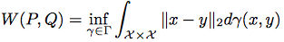
Wasserstein距离

-------

#《Unsupervised Representation Learning with Deep Convolutional Generative Adversarial Networks》

[论文地址](https://arxiv.org/abs/1511.06434)

-------


